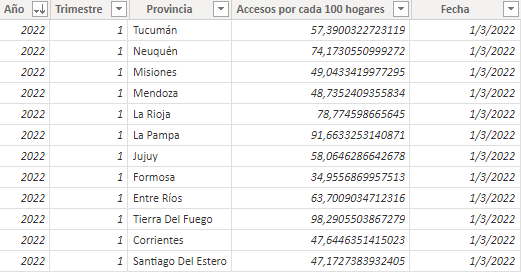
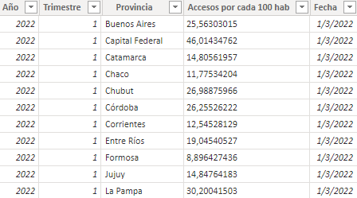
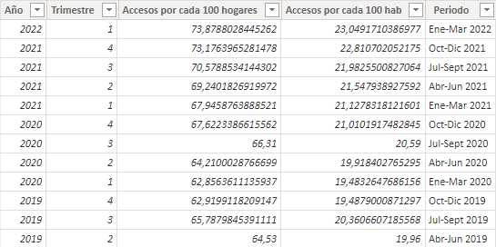
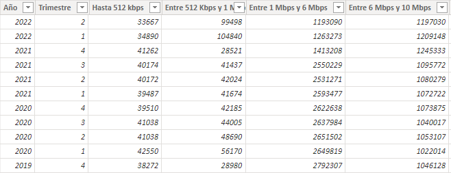
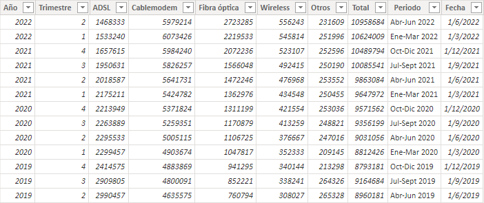
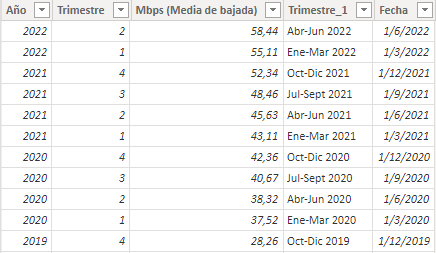
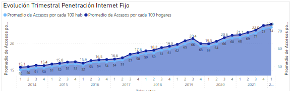
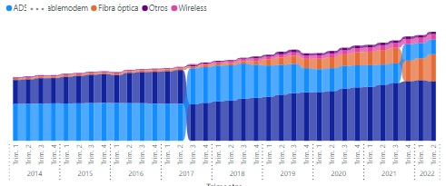

## **Informe sobre EDA (Análisis Exploratorio de Datos)**


A continuación se procederá a explicar en detalle el proceso del Análisis Exploratorio de Datos (EDA)

---


#### Herramientas utilizadas:

Microsoft Power BI


---

#### Datasets utilizados:

> *Fuente: [https://datosabiertos.enacom.gob.ar/dashboards/20000/acceso-a-internet/](https://datosabiertos.enacom.gob.ar/dashboards/20000/acceso-a-internet/)*

* **Penetracion-hogares:** penetración/ingreso de internet fijo a los hogares (por provincia, por cada 100 hogares) en Argentina

  
* **Penetracion-poblacion:** acceso de internet fijo a la población (por provincia, por cada 100 habitantes) en Argentina

  
* **Penetracion-totales:** promedio trimestral de acceso a internet fijo por poblacion y por hogares (por cada 100 hogares y por cada 100 habitantes) en Argentina

  
* **Internet_Accesos-por-velocidad:** las velocidades que se encuentran comercializadas actualmente en Argentina

  
* **Internet_Accesos-por-tecnologia:** las tecnologías que se encuentran instaladas actualmente en Argentina

  
* **historico_velocidad_internet:** la variación trimestral que hubo historicamente hasta la actualidad en Argentina

  

> ***Aclaraciones:** los datasets utilizados fueron elegidos a partir del tema específico que se quiso desarrollar (Internet en Argentina), luego de hacer un filtro sobre el total disponible en el sitio oficial del [ENACOM](https://datosabiertos.enacom.gob.ar/dashboards/20000/acceso-a-internet/).*

> *Otros datasets fueron descartados por ser estrictamente geográficos, y el objetivo principal de éste análisis es comparar la República Argentina con la región sudamericana, y eventualmente con el resto del mundo.*

> *También otros datasets ofrecían datos relacionados a otros aspectos de las telecomunicaciones que tampoco sirven para el objetivo principal de éste análisis (ej. telefonía móvil, televisión paga, telefonía fija).*

---

### Proceso de EDA

El proceso del EDA se realizó íntegramente en Power BI y constó de los siguientes pasos:

`1- Cargar y limpiar los datos:` previamente descargados los datasets en formato .CSV se procedió a la carga de los mismos mediante la herramienta de carga de datos de PowerBI y luego se realizó una limpieza en todos los datasets que constó en:

- Eliminar columnas con valores nulos

  ```
  = Table.RemoveColumns(#"Changed Type",{"Column5", "Column6", "Column7", "Column8", "Column9", "Column10", "Column11", "Column12"})
  ```
- Eliminar filas con valores nulos

  ```
  = Table.SelectRows(#"Removed Columns", each not List.IsEmpty(List.RemoveMatchingItems(Record.FieldValues(_), {"", null})))
  ```

`2- Transformar los datos:` se realizó una pequeña transformación en los datos para mejorar el análisis de los mismos.

- Se transformó el tipo de dato la columna 'Año' por numérico

```
  = Table.TransformColumns(#"Changed Type1",{{"Año", Date.Year, Int64.Type}})
```

- Se agregó una columna 'Fecha' para optimizar el filtro temporal de los datos

  ```
  Fecha = DATE([Año],[Trimestre]*3,1) 
  ```


`3- Visualizar los datos:` Se realizaron visualizaciones provisorias para tener mejores apreciaciones de algunos aspectos de la información y encontrar patrones.

Evolución Trimestral Penetración Internet  |  Variación en los Tipos de Tecnologías
:-----------------------------------------:|:--------------------------------------:
 | 

---

### Dashboards

Para acceder a los dashboards por favor ingresar [aquí](https://github.com/bigdatamartin/Project-03-Data-Analyst/blob/main/pi-henry-03.pbix) y descargar el archivo.

---

### Presentación del Análisis

Para acceder a la presentación final del Análisis, con explicaciones y anotaciones, por favor ingresar [aquí](https://github.com/bigdatamartin/Project-03-Data-Analyst/blob/main/Presentacion-pi-henry-03.pptx) y descargar el archivo.

---

### Consultas

Para consultas y/o comentarios, por favor comunicarse al mail mmgianfrini@yahoo.com


